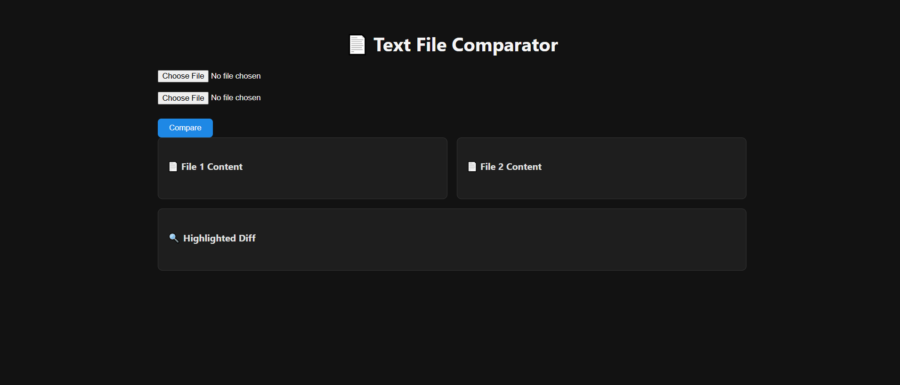
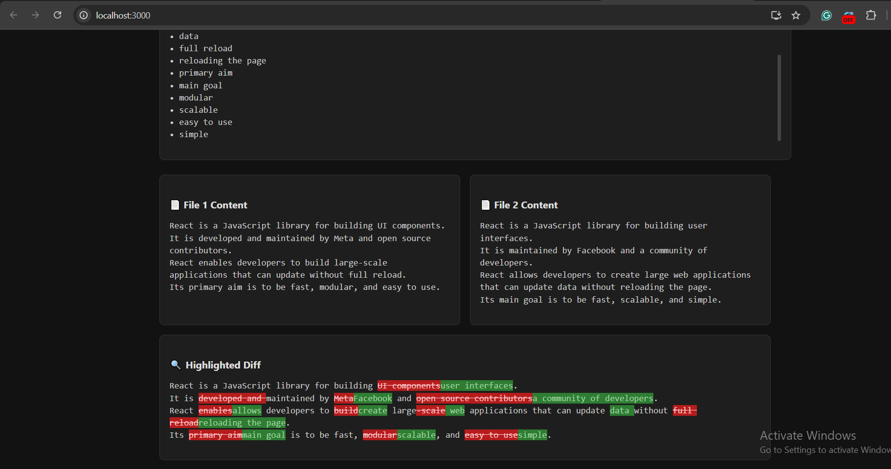

# DocuVille_Engineer_Technical_Assessment_2025
DocuVille_Engineer_Technical_Assessment_2025

# 🧠 Document Similarity Checker

## 👋 Introduction
This is a solution to the **Software Engineer Technical Assessment [2025]** for Docuville.ai. The goal of the project is to build a system that can efficiently compare two large text documents and return a similarity score between 0 and 1.

---

## 🚀 Features

- Upload two `.txt` files via a modern UI
- Displays side-by-side comparison
- Highlights differences and similarities in color
- Shows a similarity score (0-1)
- Clean and responsive **dark mode** design
- Efficient backend using cosine similarity

---

## 🖼️ Screenshots

### Main UI


### Highlighted Differences


---

## 🧩 System Design (High-Level)

[User Uploads Documents] ↓ [Frontend React App] ↓ [Backend API - Python Flask] ↓ [Preprocessing: Tokenizing, Lowercasing, Removing Punctuation] ↓ [TF-IDF Vectorization] ↓ [Cosine Similarity Calculation] ↓ [Frontend Displays Score and Differences]

yaml
Copy
Edit

---

## ⚙️ Technologies Used

### Frontend
- ReactJS
- HTML/CSS (Custom Dark Theme)
- Axios

### Backend
- Python + Flask
- Scikit-learn for TF-IDF & cosine similarity
- diff-lib for text differences

---

## 🛠️ How to Run Locally

### 1. Clone the repository
```bash
git clone https://github.com/PranjalShinde16/doc-similarity-checker.git
cd doc-similarity-checker
2. Start the Backend
bash
Copy
Edit
cd doc-similarity-backend
pip install -r requirements.txt
python app.py
3. Start the Frontend
bash
Copy
Edit
cd doc-similarity-frontend
npm install
npm start
Backend should run at http://localhost:5000, and frontend at http://localhost:3000.

🔗 Deployed Demo (Optional)
👉 Link to deployed app (if available)

🧪 Sample Input Files
You can find sample .txt files in the /samples folder for quick testing:

legal_doc_1.txt

legal_doc_2.txt

research_summary_a.txt

research_summary_b.txt

📩 Submission Instructions
Once completed, submit the following:

✅ GitHub Repo Link: https://github.com/PranjalShinde16/doc-similarity-checker

✅ Demo Link / Screenshots

✅ Email to: recruitment@docuville.ai

✅ Subject Line: Pranjal Shinde - Software Engineer - Tech Assessment

✅ Include your LinkedIn Profile

🧠 Reflections & Future Improvements
Experience:
This was a rewarding challenge. It tested my ability to blend UI/UX, performance, and algorithm design.

If given more time:

Support for more formats (PDF, DOCX)

Caching frequent comparisons

Improving accuracy with NLP techniques (Spacy, BERT)

Authentication for user-level document history

Deploying on Vercel + Render or GCP with persistent logging

🧾 License
This project is open-sourced for assessment purposes only.
